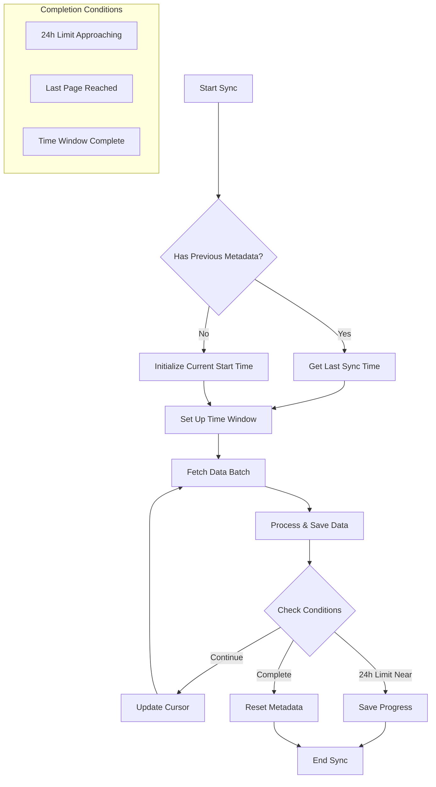
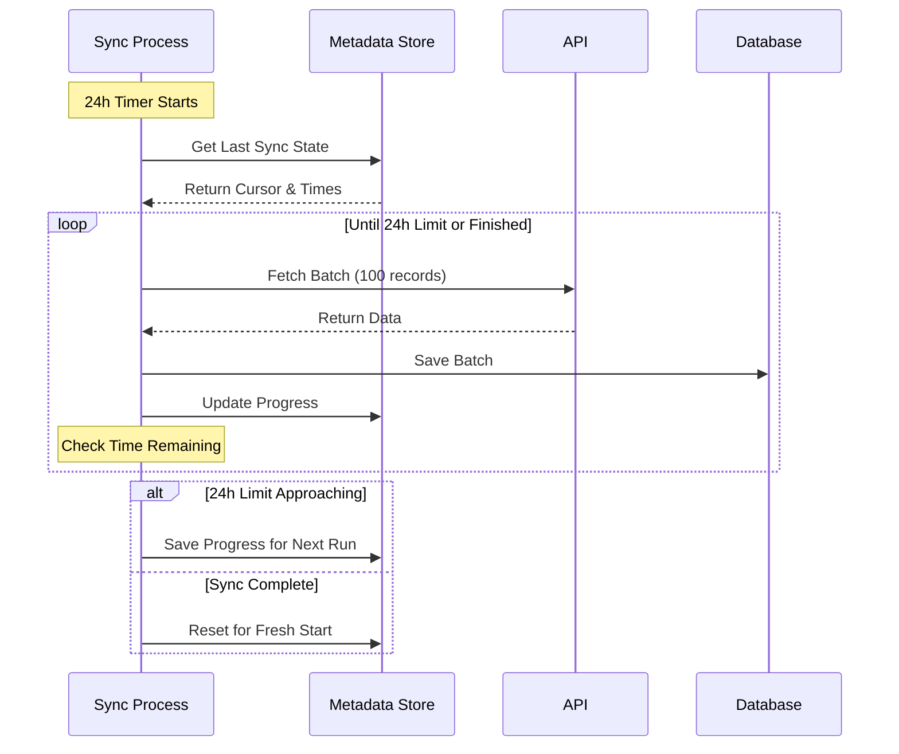

# Advanced Integration Script Patterns

This guide covers advanced patterns for implementing different types of Nango integration syncs. Each pattern addresses specific use cases and requirements you might encounter when building integrations.

## Table of Contents

1. [Configuration Based Sync](#configuration-based-sync)
2. [Selection Based Sync](#selection-based-sync)
3. [Window Time Based Sync](#window-time-based-sync)
4. [Action Leveraging Sync Responses](#action-leveraging-sync-responses)
5. [24 Hour Extended Sync](#24-hour-extended-sync)

## Configuration Based Sync

### Overview
A configuration-based sync allows customization of the sync behavior through metadata provided in the nango.yaml file. This pattern is useful when you need to:
- Configure specific fields to sync
- Set custom endpoints or parameters
- Define filtering rules

### Key Characteristics
- Uses metadata in nango.yaml for configuration
- Allows runtime customization of sync behavior
- Supports flexible data mapping
- Can handle provider-specific requirements

### Implementation Notes

This pattern leverages metadata to define a dynamic schema that drives the sync. The implementation typically consists of two parts:

1. An action to fetch available fields using the provider's introspection endpoint
2. A sync that uses the configured fields to fetch data

Example configuration in `nango.yaml`:

```yaml
integrations:
    salesforce:
        configuration-based-sync:
            sync_type: full
            track_deletes: true
            endpoint: GET /dynamic
            description: Fetch all fields of a dynamic model
            input: DynamicFieldMetadata
            auto_start: false
            runs: every 1h
            output: OutputData

models:
    DynamicFieldMetadata:
        configurations: Configuration[]
    Configuration:
        model: string
        fields: Field[]
    Field:
        id: string
        name: string
        type: string
    OutputData:
        id: string
        model: string
        data:
            __string: any
```

Example field introspection action:

```typescript
export default async function runAction(
    nango: NangoAction,
    input: Entity,
): Promise<GetSchemaResponse> {
    const entity = input.name;
    
    // Query the API's introspection endpoint
    const response = await nango.get({
        endpoint: `/services/data/v51.0/sobjects/${entity}/describe`,
    });
    // ... process and return field schema
}
```

Example sync implementation:

```typescript
import type { NangoSync } from '@nangohq/node';
import type { DynamicFieldMetadata, OutputData } from '../models.js';

const SF_VERSION = 'v59.0';

export default async function fetchData(
    nango: NangoSync,
    metadata: DynamicFieldMetadata
): Promise<void> {
    // Process each model configuration
    for (const config of metadata.configurations) {
        const { model, fields } = config;
        
        // Construct SOQL query with field selection
        const fieldNames = fields.map(f => f.name).join(',');
        const soqlQuery = `SELECT ${fieldNames} FROM ${model}`;
        
        // Query Salesforce API using SOQL
        const response = await nango.get({
            endpoint: `/services/data/${SF_VERSION}/query`,
            params: {
                q: soqlQuery
            }
        });

        // Map response to OutputData format and save
        const mappedData = response.data.records.map(record => ({
            id: record.Id,
            model: model,
            data: fields.reduce((acc, field) => {
                acc[field.name] = record[field.name];
                return acc;
            }, {} as Record<string, any>)
        }));

        // Save the batch of records
        await nango.batchSave(mappedData);
    }
}
```

Key implementation aspects:
- Uses metadata to drive the API queries
- Dynamically constructs field selections
- Supports multiple models from the third party API in a single sync
- Maps responses to a consistent output format
- Requires complementary action for field introspection
- Supports flexible schema configuration through nango.yaml

## Selection Based Sync

[To be filled in]

## Window Time Based Sync

[To be filled in]

## Action Leveraging Sync Responses

[To be filled in]

## 24 Hour Extended Sync

### Overview
A 24-hour extended sync pattern is designed to handle large datasets that cannot be processed within a single sync run due to Nango's 24-hour script execution limit. This pattern is essential when:
- Your sync needs to process more data than can be handled within 24 hours
- You need to handle API rate limits while staying within the execution limit
- You're dealing with very large historical datasets
- You need to ensure data consistency across multiple sync runs

### Why This Pattern?

Nango enforces a 24-hour limit on script execution time for several reasons:
- To prevent runaway scripts that could impact system resources
- To ensure fair resource allocation across all integrations
- To maintain system stability and predictability
- To encourage efficient data processing patterns

When your sync might exceed this limit, you need to:
1. Break down the sync into manageable chunks
2. Track progress using metadata
3. Resume from where the last run stopped
4. Ensure data consistency across runs

### Visual Representation





### Key Characteristics
- Uses cursor-based pagination with metadata persistence
- Implements time-remaining checks
- Gracefully handles the 24-hour limit
- Maintains sync state across multiple runs
- Supports automatic resume functionality
- Ensures data consistency between runs

### Implementation Notes

This pattern uses metadata to track sync progress and implements time-aware cursor-based pagination. Here's a typical implementation:

```typescript
export default async function fetchData(nango: NangoSync): Promise<void> {
    const START_TIME = Date.now();
    const MAX_RUNTIME_MS = 23.5 * 60 * 60 * 1000; // 23.5 hours in milliseconds
    
    // Get or initialize sync metadata
    let metadata = await nango.getMetadata<SyncCursor>();
    
    // Initialize sync window if first run
    if (!metadata?.currentStartTime) {
        await nango.updateMetadata({ 
            currentStartTime: new Date(),
            lastProcessedId: null,
            totalProcessed: 0
        });
        metadata = await nango.getMetadata<SyncCursor>();
    }
    
    let shouldContinue = true;
    
    while (shouldContinue) {
        // Check if we're approaching the 24h limit
        const timeElapsed = Date.now() - START_TIME;
        if (timeElapsed >= MAX_RUNTIME_MS) {
            // Save progress and exit gracefully
            await nango.log('Approaching 24h limit, saving progress and exiting');
            return;
        }
        
        // Fetch and process data batch
        const response = await fetchDataBatch(metadata.lastProcessedId);
        await processAndSaveData(response.data);
        
        // Update progress
        await nango.updateMetadata({
            lastProcessedId: response.lastId,
            totalProcessed: metadata.totalProcessed + response.data.length
        });
        
        // Check if we're done
        if (response.isLastPage) {
            // Reset metadata for fresh start
            await nango.updateMetadata({
                currentStartTime: null,
                lastProcessedId: null,
                totalProcessed: 0
            });
            shouldContinue = false;
        }
    }
}

async function fetchDataBatch(lastId: string | null): Promise<DataBatchResponse> {
    const config: ProxyConfiguration = {
        endpoint: '/data',
        params: {
            after: lastId,
            limit: 100
        },
        retries: 10
    };
    
    return await nango.get(config);
}
```

Key implementation aspects:
- Tracks elapsed time to respect the 24-hour limit
- Maintains detailed progress metadata
- Implements cursor-based pagination
- Provides automatic resume capability
- Ensures data consistency across runs
- Handles rate limits and data volume constraints

### Best Practices
1. Leave buffer time (e.g., stop at 23.5 hours) to ensure clean exit
2. Save progress frequently
3. Use efficient batch sizes
4. Implement proper error handling
5. Log progress for monitoring
6. Test resume functionality thoroughly

### Common Pitfalls
1. Not accounting for API rate limits in time calculations
2. Insufficient progress tracking
3. Not handling edge cases in resume logic
4. Inefficient batch sizes
5. Poor error handling
6. Incomplete metadata management

## Best Practices

[To be filled in]

## Common Pitfalls

[To be filled in] 